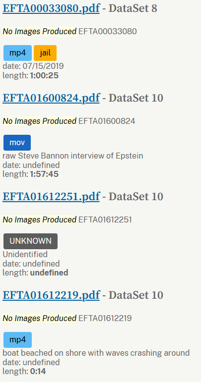

# Epstein File description
I was frustrated looking at the [Epstein files](https://www.justice.gov/epstein) and not having any info about what file might contain. This is especially true for videos which show up as pdfs.

This extension will add some tags with basic info and a description with more details.



This is a WIP as there are 3 million files (~3,000 videos) and the DOJ search results are not always in order (requires extra care checking). Please be patient or add info to help.

## How to use

1. Click `<> Code` button top right-ish, download ZIP.
2. Unzip file somewhere
2. In Chromium browser, goto url chrome://extensions
3. Ensure you're on Developer mode (top right)
4. Click Load unpacked, and select unzipped file from step 2

## Helpful Hints

### Videos
Many of the videos, search:
>no images produced

click on a file and change (pdf->mp4/mov)

Dataset 10 starts page 15 of results (Dataset 8 is mostly jail)

### Get Metadata Template (for adding to extension)
From console
```
JSON.stringify(Object.fromEntries(Array.from(document.querySelectorAll('.result-item h3 a')).map(link=>[link.textContent.replaceAll('.pdf',''), {tags: ['UNKNOWN'], description: '', len: '', date: ''}])))
```